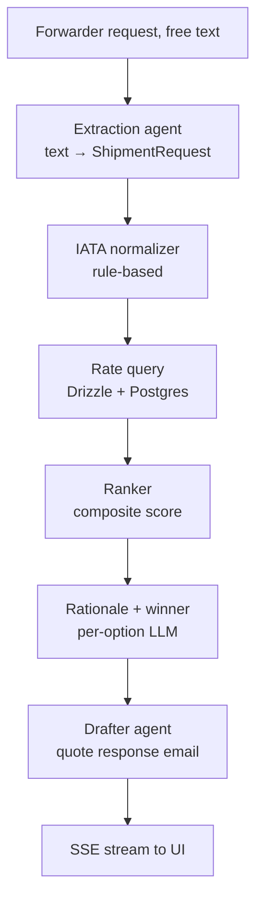

# Cargo Concierge

A small prototype of a freight forwarder copilot. You paste a customer email asking for a quote, and you get back ranked airline options plus a draft reply, in about ten seconds.

I built this after looking at how forwarders actually spend their day. The honest answer is: reading a customer email, retyping the shipment details into a quote tool or three, comparing the answers, then writing back. Most of that is mechanical.

## How it works

1. Pull the shipment fields out of the email. Free text in, structured object out, validated with Zod.
2. Query rates from 12 airlines across 30 lanes (seeded from public market patterns). Filter by capacity, commodity rules, weight band, special handling.
3. Score the candidates with a deterministic composite (price, transit, reliability, capacity). The weights shift based on the customer's service level. AOG cares about transit; general cares about price.
4. Write a one-line rationale per option. Pick a winner with a paragraph.
5. Draft the reply email the forwarder can send back.

The whole thing streams stage by stage, so you can watch the pipeline work.

## Quickstart

```bash
git clone https://github.com/umarfarook1/Cargo-Concierge
cd Cargo-Concierge
npm install
cp .env.example .env
# fill in DATABASE_URL and at least one model API key
npm run db:push
npm run db:seed
npm run dev
```

Open `http://localhost:3000`, click one of the sample requests, hit Get quote.

**Database:** any Postgres. Supabase or Neon free tier is the path of least resistance.

**Models:** one provider key is enough. The chain falls back through `PRIMARY_MODEL`, `FALLBACK_MODEL`, `SECONDARY_FALLBACK_MODEL` if a call errors or rate-limits.

## Stack

Next.js 16, TypeScript, Mastra agents, Vercel AI SDK, Postgres via Drizzle, Tailwind, deployed to Vercel.

The design rule I followed: LLM only where it earns its place. Extraction is ambiguous, so it uses an LLM. Rate filtering and price math are deterministic SQL. Ranking is deterministic scoring with an LLM rationale on top. This keeps things cheap, fast, and easy to debug when something looks wrong.

## Architecture



## Evaluation

The eval set is 30 hand-labeled forwarder messages: general dry cargo, perishable, pharma cold chain, lithium batteries, AOG, multi-leg. Origins and destinations span four regions.

```bash
npm run eval
```

This prints a per-field accuracy table and writes `evals/results/extraction.md`. Grading rules:

| Field | How it's scored |
|---|---|
| origin_iata, destination_iata | Exact |
| pieces | Exact |
| gross_weight_kg | Within 5% |
| commodity_type, service_level | Exact |
| special_handling | Set equality |

Ablations live in `npm run eval:ablations`. The four variants are: primary model with full instructions, same model with minimal instructions (does the prompt earn its keep?), and two alternative providers with full instructions (does the model matter?). 15-item sample to keep it cheap.

## Repo layout

```
app/
  api/quote/route.ts        SSE streaming endpoint
  page.tsx                  chat UI
lib/
  agents/
    extraction.ts           text → ShipmentRequest
    rate-query.ts           ShipmentRequest → RateOption[]
    ranker.ts               score + per-option rationale
    drafter.ts              quote response email
    index.ts                pipeline orchestrator
  db/
    schema.ts               drizzle tables
    seed.ts                 12 airlines, 29 airports, 30 lanes, rates
  airports.ts               IATA alias resolution
  llm.ts                    model chain with fallback
  schemas.ts                shared Zod contracts
evals/
  dataset.json              30 examples
  run.ts                    extraction eval
  ablations.ts              model + prompt ablations
```

## What's missing (honest list)

- **Simulated data.** Airline names are real. Rates, capacity, transit times, reliability scores are simulated from public patterns. No real airline API is integrated.
- **Lane coverage is narrow.** 30 lanes across 29 airports. Adding more is a one-line append in `lib/db/seed.ts`, but real coverage means an ETL from carrier rate sheets.
- **No customs, no DG paperwork.** A production version needs IATA DGR validation, HS code lookup, AWB generation. Out of scope for the prototype.
- **No retry loop on extraction.** If the LLM returns invalid JSON the call fails. The right fix is to re-prompt with the validation error, which I want to add.
- **No memory or session.** Each request is independent. Multi-turn ("what if we shift to Tuesday?") is the natural next step.

## What I'd build next

IATA DGR rule engine. Multi-turn refinement. Cost and token counters per stage in the UI. A small HS-code classifier from commodity descriptions.

## License

MIT.
